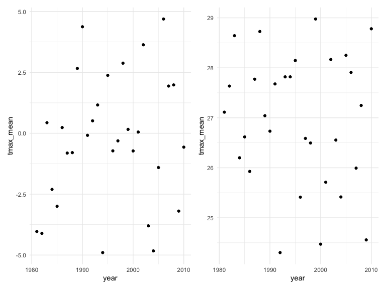
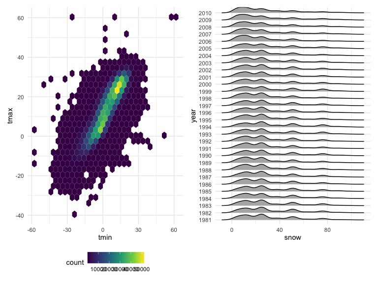

Homework 3
================
Lincole Jiang
October 15th, 2022

### Due date

Due: October 15 at 11:59pm.

### Points

| Problem         | Points    |
|:----------------|:----------|
| Problem 0       | 20        |
| Problem 1       | –         |
| Problem 2       | 40        |
| Problem 3       | 40        |
| Optional survey | No points |

### Problem 0

This “problem” focuses on the structure of submission, especially the
use git and GitHub for reproducibility, R Projects to organize work, R
Markdown to write reproducible reports, relative paths to load data from
local files, and reasonable naming structures for files.

### Problem 1

#### Read in the data

``` r
data("instacart")

instacart = 
  instacart %>% 
  as_tibble(instacart)
```

#### Answer questions about the data

This dataset contains 1384617 rows and 15 columns, with each row
resprenting a single product from an instacart order. Variables include
identifiers for user, order, and product; the order in which each
product was added to the cart. There are several order-level variables,
describing the day and time of the order, and number of days since prior
order. Then there are several item-specific variables, describing the
product name (e.g. Yogurt, Avocado), department (e.g. dairy and eggs,
produce), and aisle (e.g. yogurt, fresh fruits), and whether the item
has been ordered by this user in the past. In total, there are 39123
products found in 131209 orders from 131209 distinct users.

Below is a table summarizing the number of items ordered from aisle. In
total, there are 134 aisles, with fresh vegetables and fresh fruits
holding the most items ordered by far.

``` r
instacart %>% 
  count(aisle) %>% 
  arrange(desc(n))
```

    ## # A tibble: 134 × 2
    ##    aisle                              n
    ##    <chr>                          <int>
    ##  1 fresh vegetables              150609
    ##  2 fresh fruits                  150473
    ##  3 packaged vegetables fruits     78493
    ##  4 yogurt                         55240
    ##  5 packaged cheese                41699
    ##  6 water seltzer sparkling water  36617
    ##  7 milk                           32644
    ##  8 chips pretzels                 31269
    ##  9 soy lactosefree                26240
    ## 10 bread                          23635
    ## # … with 124 more rows

Next is a plot that shows the number of items ordered in each aisle.
Here, aisles are ordered by ascending number of items.

``` r
instacart %>% 
  count(aisle) %>% 
  filter(n > 10000) %>% 
  mutate(aisle = fct_reorder(aisle, n)) %>% 
  ggplot(aes(x = aisle, y = n)) + 
  geom_point() + 
  labs(title = "Number of items ordered in each aisle") +
  theme(axis.text.x = element_text(angle = 60, hjust = 1))
```


Our next table shows the three most popular items in aisles
`baking ingredients`, `dog food care`, and `packaged vegetables fruits`,
and includes the number of times each item is ordered in your table.

``` r
instacart %>% 
  filter(aisle %in% c("baking ingredients", "dog food care", "packaged vegetables fruits")) %>%
  group_by(aisle) %>% 
  count(product_name) %>% 
  mutate(rank = min_rank(desc(n))) %>% 
  filter(rank < 4) %>% 
  arrange(desc(n)) %>%
  knitr::kable()
```

| aisle                      | product_name                                  |    n | rank |
|:---------------------------|:----------------------------------------------|-----:|-----:|
| packaged vegetables fruits | Organic Baby Spinach                          | 9784 |    1 |
| packaged vegetables fruits | Organic Raspberries                           | 5546 |    2 |
| packaged vegetables fruits | Organic Blueberries                           | 4966 |    3 |
| baking ingredients         | Light Brown Sugar                             |  499 |    1 |
| baking ingredients         | Pure Baking Soda                              |  387 |    2 |
| baking ingredients         | Cane Sugar                                    |  336 |    3 |
| dog food care              | Snack Sticks Chicken & Rice Recipe Dog Treats |   30 |    1 |
| dog food care              | Organix Chicken & Brown Rice Recipe           |   28 |    2 |
| dog food care              | Small Dog Biscuits                            |   26 |    3 |

Finally is a table showing the mean hour of the day at which Pink Lady
Apples and Coffee Ice Cream are ordered on each day of the week. This
table has been formatted in an untidy manner for human readers. Pink
Lady Apples are generally purchased slightly earlier in the day than
Coffee Ice Cream, with the exception of day 5.

``` r
instacart %>%
  filter(product_name %in% c("Pink Lady Apples", "Coffee Ice Cream")) %>%
  group_by(product_name, order_dow) %>%
  summarize(mean_hour = mean(order_hour_of_day)) %>%
  spread(key = order_dow, value = mean_hour) %>%
  knitr::kable(digits = 2)
```

    ## `summarise()` has grouped output by 'product_name'. You can override using the
    ## `.groups` argument.

| product_name     |     0 |     1 |     2 |     3 |     4 |     5 |     6 |
|:-----------------|------:|------:|------:|------:|------:|------:|------:|
| Coffee Ice Cream | 13.77 | 14.32 | 15.38 | 15.32 | 15.22 | 12.26 | 13.83 |
| Pink Lady Apples | 13.44 | 11.36 | 11.70 | 14.25 | 11.55 | 12.78 | 11.94 |

### Problem 2

For this problem, we look at the accelerometer data collected on a 63
year-old male with BMI 25. Firstly, we import and wrangle the data. More
specifically, we create a new factor variable wkdy_vs_wknd to indicate
whether the data is from a weekday or a weekend; use pivot_longer to
create variables minute and activity that indicates the minute at which
the activity is recorded and the activity count during that particular
minute interval, respectively, and makes sure each variable is of the
most reasonable variable class.

``` r
accel_df <- read_csv("./data/accel_data.csv") %>%
  janitor::clean_names() %>%
  pivot_longer(cols = starts_with("activity"),
               names_to = "minute",
               names_prefix = "activity.",
               values_to = "activity") %>%
  mutate(wkdy_vs_wknd = ifelse(day == "Saturday" | day == "Sunday", "weekend", "weekday"),
         minute = as.integer(minute),
         wkdy_vs_wknd = as.factor(wkdy_vs_wknd)) 
```

    ## Rows: 35 Columns: 1443
    ## ── Column specification ────────────────────────────────────────────────────────
    ## Delimiter: ","
    ## chr    (1): day
    ## dbl (1442): week, day_id, activity.1, activity.2, activity.3, activity.4, ac...
    ## 
    ## ℹ Use `spec()` to retrieve the full column specification for this data.
    ## ℹ Specify the column types or set `show_col_types = FALSE` to quiet this message.

Now, we provide a description for data set accel. This data is collected
on a 63 year-old male with BMI 25 over the span of 5 weeks, who was
admitted to the Cardiac Care Center of CUMC and diagnosed with
congestive heart failure. More specifically, there are 6 variables and
50400 observations; and below provides a description for each variable.

Variable *week* indicates the week for which the observation is made
since the beginning of the study. It is a numeric variable. It takes
values from 1 to 5.

Variable *day_id* indicates the day for which the observation is made
since the beginning of the study. It is a numeric variable and takes
values from 1 to 35.

Variable *day* indicates the day of the week for which the observation
is made. It is a character variable.

Variable *minute* indicates the minute for which the observation is
made. It is a integer variable.

Variable *activity* indicates activity counts measured in the duration
of the one-minute interval of the particular observation. It is a
numeric variable and its range is from 1 to 8982.

Variable *wkdy_vs_wknd* indicates whether the observation was recorded
on a weekday or on a weekend. It is a factor variable.

Now, we turn our attention to the total activity over the day and by
week. To do this, we aggregate across minutes to create a total activity
variable for each day and create a table showing the totals.

``` r
accel_act <- accel_df %>% 
  group_by(day, week) %>%
  summarize(total_activity = sum(activity)) 
```

    ## `summarise()` has grouped output by 'day'. You can override using the `.groups`
    ## argument.

``` r
accel_act %>% 
  pivot_wider(
    names_from = day, 
    values_from = total_activity) %>%
  knitr::kable() # to show the table
```

| week |   Friday |    Monday | Saturday | Sunday | Thursday |  Tuesday | Wednesday |
|-----:|---------:|----------:|---------:|-------:|---------:|---------:|----------:|
|    1 | 480542.6 |  78828.07 |   376254 | 631105 | 355923.6 | 307094.2 |    340115 |
|    2 | 568839.0 | 295431.00 |   607175 | 422018 | 474048.0 | 423245.0 |    440962 |
|    3 | 467420.0 | 685910.00 |   382928 | 467052 | 371230.0 | 381507.0 |    468869 |
|    4 | 154049.0 | 409450.00 |     1440 | 260617 | 340291.0 | 319568.0 |    434460 |
|    5 | 620860.0 | 389080.00 |     1440 | 138421 | 549658.0 | 367824.0 |    445366 |

To explore the trends associated with this data set, we create a ggplot
where x-axis is week, y-axis is activity, and the color indicates day.

``` r
accel_act %>% 
  ggplot(aes(x = week, y = total_activity, color = day)) +
  geom_smooth()
```

    ## `geom_smooth()` using method = 'loess' and formula 'y ~ x'


As such, we could perhaps conclude that week 4 has the lowest activity,
and Monday and Friday are where activity is the most variable in all
weeks.

Finally, we make a single-panel plot showing the 24-hour activity time
courses for each day and use color to indicate day of the week.

``` r
accel_df %>% 
  ggplot(aes(x = minute, y = activity)) +
  geom_point(aes(color = day))
```


To describe the graph, it seems like the activity before \~300 minute
has no ostensibly high counts, whereas exceeding \~300 minute there
seems to be a general increase in activity count as well as very high
counts compared to the former part. The plot can be said to be skewed to
the left. There doesn’t seem to be much variance in activity via day of
the week, on the other hand.

### Problem 3

For this problem, we explore “NY NOAA” data. We first load the data.

``` r
library(p8105.datasets)
data("ny_noaa")
```

First, we provide a brief description of the data. Firstly, data has 7
variables and 2595176 observations. Specifically, *id* is a character
variable that describes Weather station ID; *date* is a Date variable
that describes the date of the observation; *prcp* is a character
variable that describes the precipitation in tenths of mm; *snow* is a
integer variable indicating snowfall in mm; *snwd* is a integer variable
indicating snow depth in mm; and *tmax* and *tmin* are character
variables indicating the maximum and minimum temperature in tenths of
degrees C, respectively. On the other hand, missing value is a problem
for this data set. Of the 2595176 recorded by this data set, the number
of missing values for id and date are both 0, for prcp is 145838, for
snow is 381221, for snwd is 591786, for tmax is 1134358, and for tmin is
1134420.

Now, we attempt to clean the data set. In this step, we create separate
variables for year, month, and day; modify units for temperature,
precipitation, and snowfall such that they are reasonable.

``` r
ny_noaa <- ny_noaa %>% 
  mutate(date = as.character(date),
         tmax = as.numeric(tmax),
         tmin = as.numeric(tmin)) %>%
  separate(date, into = c("year", "month", "day"), sep = "-") %>%
  mutate(
    year = as.integer(year),
    month = as.integer(month),
    day = as.integer(day),
    tmax = tmax * 0.1,
    tmin = tmin * 0.1,
    prcp = prcp * 0.1)
```

In this way, the unit for tmax and tmin are in degree C, and the units
for prcp, snow, and snwd are all in mm. We now try to show the most
commonly observed value for snowfall by writing a find_mode function as
shown below.

``` r
find_mode <- function(x) {
  u <- unique(x)
  tab <- tabulate(match(x, u))
  u[tab == max(tab)]
}
```

In this way, we know that the most commonly observed value for snowfall
is 0. Next, we make a two-panel plot showing the average max temperature
in January and in July in each station across years.

``` r
tmax_jan <- 
  ny_noaa %>%
  filter(month == 1) %>% 
  group_by(year) %>% 
  summarize(tmax_mean = mean(tmax, na.rm=TRUE)) %>%
  ggplot(aes(x = year, y = tmax_mean)) +
  geom_point()

tmax_jul <- 
  ny_noaa %>%
  filter(month == 7) %>% 
  group_by(year) %>% 
  summarize(tmax_mean = mean(tmax, na.rm=TRUE)) %>%
  ggplot(aes(x = year, y = tmax_mean)) +
  geom_point()

tmax_jan + tmax_jul
```



It seems like the average max temperature in a year follows very roughly
linearly for both January and July, but there due to the scattered
nature of both of these structures, it is difficult to conclude whether
the outstanding observations are outliers or if the distribution is in
fact random.

Finally, we make a two-panel plot showing 1) tmax vs. tmin for the full
data set and 2) the distribution of snowfall values greater than 0 and
less than 100 separately by year.

``` r
tmax_vs_tmin <- 
  ny_noaa %>%
  select(tmin, tmax) %>%
  drop_na() %>%
  ggplot(aes(x = tmin, y = tmax)) +
  geom_hex()

snowf <- 
  ny_noaa %>% 
  filter(snow > 0 & snow < 100) %>%
  mutate(year = as.factor(year)) %>%
  ggplot(aes(x = snow, y = year)) +
  geom_density_ridges(scale = .85)

tmax_vs_tmin + snowf
```

    ## Picking joint bandwidth of 3.76


